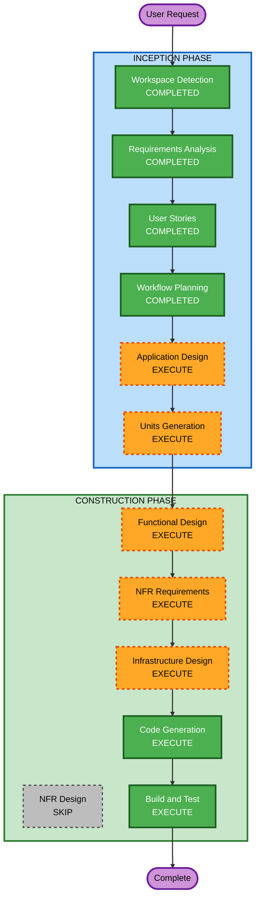

# Execution Plan

## Detailed Analysis Summary

### Change Impact Assessment
- **User-facing changes**: Yes — 고객용 주문 UI + 관리자용 대시보드 UI
- **Structural changes**: Yes — 새 프로젝트 전체 아키텍처 설계 필요
- **Data model changes**: Yes — 매장, 테이블, 메뉴, 카테고리, 주문, 세션 스키마 설계
- **API changes**: Yes — REST API 전체 설계 (고객용 + 관리자용)
- **NFR impact**: Yes — SSE 실시간 통신, JWT 인증, Docker 배포

### Risk Assessment
- **Risk Level**: Medium (새 프로젝트이나 표준 웹 아키텍처, 소규모 운영)
- **Rollback Complexity**: Easy (Greenfield, 기존 시스템 영향 없음)
- **Testing Complexity**: Moderate (실시간 통신, 세션 관리 테스트 필요)

---

## Workflow Visualization



### Text Alternative
```
INCEPTION PHASE:
  [COMPLETED] Workspace Detection
  [COMPLETED] Requirements Analysis
  [COMPLETED] User Stories
  [COMPLETED] Workflow Planning
  [EXECUTE]   Application Design
  [EXECUTE]   Units Generation

CONSTRUCTION PHASE:
  [EXECUTE]   Functional Design (per-unit)
  [EXECUTE]   NFR Requirements (per-unit)
  [SKIP]      NFR Design
  [EXECUTE]   Infrastructure Design (per-unit)
  [EXECUTE]   Code Generation (per-unit)
  [EXECUTE]   Build and Test
```

---

## Phases to Execute

### INCEPTION PHASE
- [x] Workspace Detection (COMPLETED)
- [x] Requirements Analysis (COMPLETED)
- [x] User Stories (COMPLETED)
- [x] Workflow Planning (COMPLETED)
- [ ] Application Design - EXECUTE
  - **Rationale**: 새 프로젝트로 컴포넌트 식별, 서비스 레이어 설계, 데이터 모델 정의 필요
- [ ] Units Generation - EXECUTE
  - **Rationale**: 고객/관리자 기능을 별도 유닛으로 분리하여 병렬 개발 가능하도록 구조화

### CONSTRUCTION PHASE (per-unit)
- [ ] Functional Design - EXECUTE
  - **Rationale**: 주문 상태 흐름, 세션 라이프사이클, 카테고리 cascade 등 비즈니스 로직 상세 설계 필요
- [ ] NFR Requirements - EXECUTE
  - **Rationale**: SSE 실시간 통신, JWT 인증, Docker 배포 등 기술 스택 선정 및 NFR 평가 필요
- [ ] NFR Design - SKIP
  - **Rationale**: 소규모 운영(10명 이하), 보안 확장 미적용. NFR Requirements에서 기본 패턴 결정으로 충분
- [ ] Infrastructure Design - EXECUTE
  - **Rationale**: Docker Compose 구성, DB 스키마, 서비스 간 통신 설계 필요
- [ ] Code Generation - EXECUTE (ALWAYS)
  - **Rationale**: 실제 코드 구현
- [ ] Build and Test - EXECUTE (ALWAYS)
  - **Rationale**: 빌드 및 테스트 검증

### OPERATIONS PHASE
- [ ] Operations - PLACEHOLDER

---

## Success Criteria
- **Primary Goal**: 고객이 테이블에서 메뉴를 주문하고, 관리자가 실시간으로 모니터링할 수 있는 MVP 완성
- **Key Deliverables**:
  - 고객용 React 웹 앱 (메뉴 조회, 장바구니, 주문)
  - 관리자용 React 웹 앱 (대시보드, 테이블/메뉴/카테고리 관리)
  - NestJS 백엔드 API (REST + SSE)
  - PostgreSQL 데이터베이스 스키마
  - Docker Compose 배포 구성
- **Quality Gates**:
  - 모든 API 엔드포인트 동작 확인
  - SSE 실시간 주문 전달 2초 이내
  - 장바구니 로컬 저장 유지
  - JWT 인증 및 세션 관리 정상 동작
